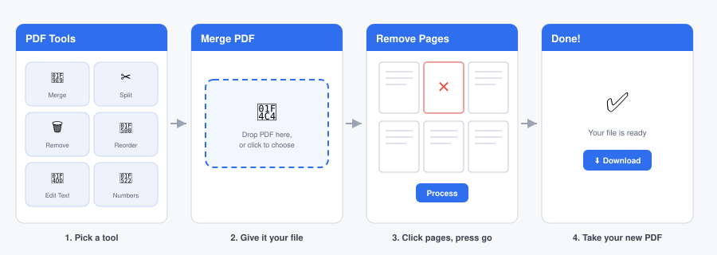
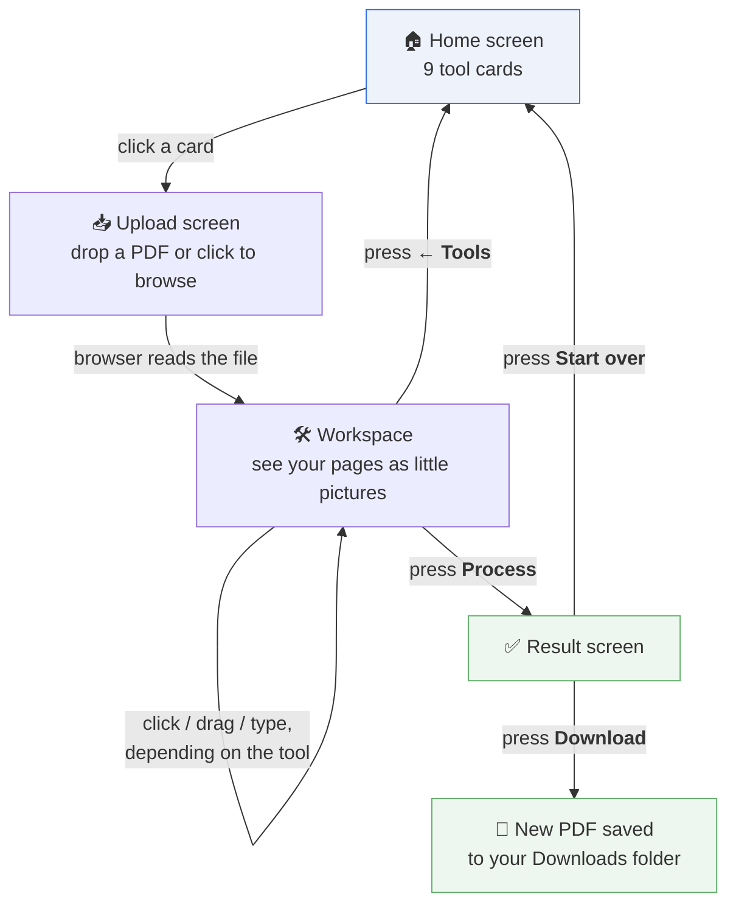
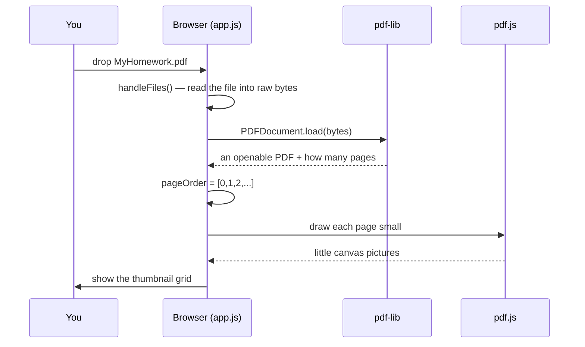
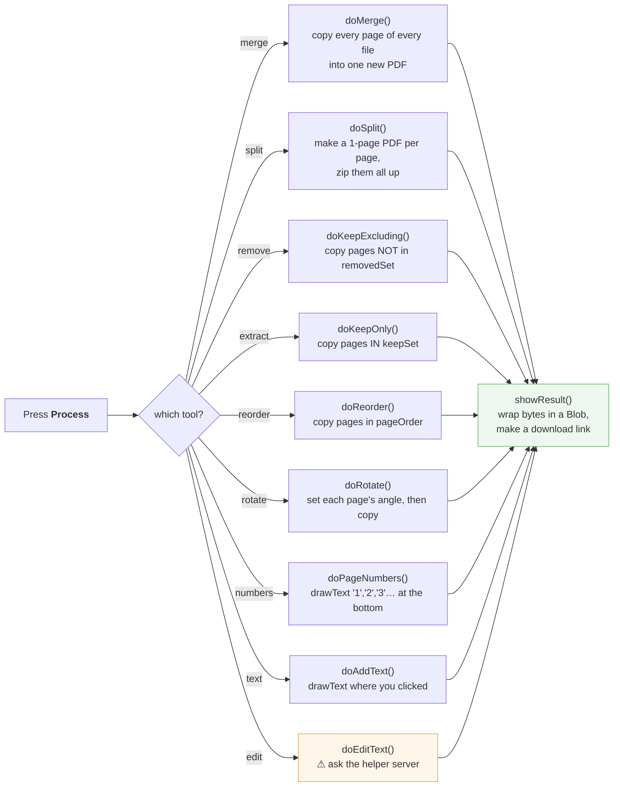
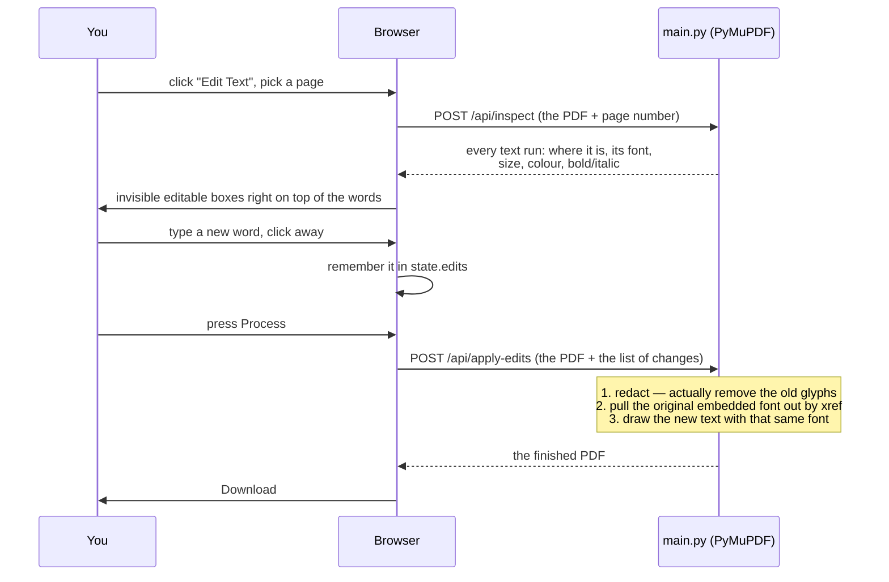

# 📄 PDF Tools

A little website that fixes PDFs for you — glue them together, chop them apart, throw pages away, spin them around, number them, or change the words on them.

**The best part:** it doesn't send your file anywhere. Everything happens right inside your own web browser, like a calculator app that works even when the Wi-Fi is off.



---

## Table of contents

- [Explain it like I'm 10](#explain-it-like-im-10)
- [The nine tools](#the-nine-tools)
- [How you use it, step by step](#how-you-use-it-step-by-step)
- [What's inside the box (the files)](#whats-inside-the-box-the-files)
- [How the code actually works](#how-the-code-actually-works)
- [The one weird tool: Edit Text](#the-one-weird-tool-edit-text)
- [Running it yourself](#running-it-yourself)
- [Privacy](#privacy)
- [Ideas for making it better](#ideas-for-making-it-better)

---

## Explain it like I'm 10

Imagine a PDF is a **stack of paper held together with a big paperclip**.

Normally, to move the pages around you'd need scissors, tape, and a photocopier. This website is the scissors and tape — except it's on your screen, and nothing gets ruined if you make a mistake, because it always gives you a **brand-new stack** and leaves your original one completely untouched.

Here's the trick that surprises most people: **the website doesn't have a computer somewhere else doing the work.** When you open a normal website — YouTube, say — your computer asks a big machine far away to do things for you. This one doesn't. All the cutting and taping happens on *your* laptop, in the browser tab. That's why it's fast, why it works on an airplane with no internet, and why nobody in the world ever sees your file.


There's exactly **one** exception, the "Edit Text" tool, which needs a small helper program. We'll get to that at the end — and even then, the helper is a program *you* run on *your own* computer.

---

## The nine tools

| | Tool | What it does | Real-life version |
|---|---|---|---|
| 🧩 | **Merge PDF** | Sticks 2+ PDFs into one, in whatever order you drag them | Stapling three worksheets together |
| ✂️ | **Split PDF** | Turns a 10-page PDF into 10 one-page PDFs, zipped up | Pulling every page apart and putting them in an envelope |
| 🗑️ | **Remove Pages** | Deletes the pages you tap | Ripping out the boring pages |
| 📑 | **Extract Pages** | Keeps *only* the pages you tap | Photocopying just pages 4 and 7 |
| 🔀 | **Reorder Pages** | Drag pages into a new order | Shuffling the stack |
| 🔄 | **Rotate PDF** | Turns pages 90° at a time | Someone scanned it sideways. Again. |
| 📝 | **Edit Text** | Change words that are already on the page | Erasing a word and writing a new one in the same handwriting |
| 🔢 | **Add Page Numbers** | Stamps 1, 2, 3… at the bottom | Numbering pages by hand |
| ✏️ | **Add Text** | Click anywhere, type something new | Scribbling a note in the margin |

Every one of these is fully offline **except Edit Text** (📝).

---

## How you use it, step by step



The whole website is **one single page**. There are four `<section>` blocks in `index.html`, and only one of them is visible at a time. "Changing screens" is really just JavaScript adding the CSS class `active` to one section and taking it off the others — the function `showScreen()` in `app.js:30`. Nothing ever reloads.

---

## What's inside the box (the files)

```
pdf/
├── index.html         the skeleton — the 4 screens, and nothing else
├── style.css          the paint job — colors, spacing, the tool-card grid
├── app.js             the brain — every single thing the site does (~490 lines)
├── main.py            the optional helper server, for the Edit Text tool
├── requirements.txt   the 4 Python packages that helper needs
├── Dockerfile         a recipe for running the helper in a container
└── docs/              the pictures used in this README
```

Only three files matter for the website itself: `index.html`, `style.css`, `app.js`.
There is **no build step, no `npm install`, no framework**. You can open `index.html` by double-clicking it and the whole thing works.

### The two libraries it borrows

Writing PDF code from scratch would take years, so the site loads two free tools from the internet (a CDN), plus a zip helper:

| Library | Job | Think of it as… |
|---|---|---|
| [**pdf-lib**](https://pdf-lib.js.org/) | *Changes* PDFs — copies pages, rotates them, draws text | The scissors and tape |
| [**pdf.js**](https://mozilla.github.io/pdf.js/) | *Shows* PDFs — turns a page into a picture on screen | The eyes |
| [**JSZip**](https://stuk.github.io/jszip/) | Bundles many files into one `.zip` | The envelope |

They're loaded by the three `<script>` tags at the top of `index.html`. That's the *only* thing the site fetches from the internet.

---

## How the code actually works

### 1. There is one big notebook called `state`

Everything the app is currently thinking about lives in one object (`app.js:23`):

```js
state = {
  tool: null,          // which tool you picked
  files: [],           // the actual file(s) you dropped in
  fileBytes: [],       // those files as raw bytes (for Merge)
  pdfDoc: null,        // the PDF, opened by pdf-lib
  pageOrder: [],       // e.g. [0,1,2,3] — and Reorder shuffles this list
  removedSet: new Set(),  // pages you tapped to delete
  keepSet: new Set(),     // pages you tapped to keep
  rotationDelta: {},      // { pageIndex: 90 }
  texts: {},              // new text you added
  edits: {},              // existing text you changed
}
```

Pressing **← Tools** or **Start over** calls `resetState()`, which throws the whole notebook away and starts fresh. That's why the app never gets confused between two jobs.

The clever bit is `pageOrder`. The app almost never *really* moves pages around while you're working — it just rearranges this little list of numbers. Only at the very end does it build a real PDF by copying pages in that order (`copyOrderTo()`, `app.js:411`). Shuffling numbers is instant; shuffling actual PDF pages is slow.

### 2. What happens when you drop a file in



Those little page pictures ("thumbnails") are made in `renderThumbs()` (`app.js:164`). For each page, pdf.js paints it onto a `<canvas>` at 40% size — a canvas is just a rectangle the browser can draw pixels on. Then, depending on which tool you chose, the code attaches different behavior to each thumbnail:

- **Remove** → clicking toggles it into `removedSet` and shows a ✕
- **Extract** → clicking toggles it in `keepSet` and shows a ✓ (everything starts selected)
- **Rotate** → each thumbnail gets a little ⟳ button
- **Reorder** → each thumbnail becomes draggable
- **Add Text / Edit Text** → clicking opens the big page editor

Same grid, different personality. That's the whole design of the app.

### 3. What happens when you press Process

One `switch` statement (`app.js:371`) sends you to the right function:



Notice how boring most of them are — Remove, Extract and Reorder are *the same function* with a different list of page numbers. Once you see that, the app is much smaller than it looks.

At the end, `showResult()` (`app.js:475`) turns the finished bytes into a **Blob** (a pretend file that only exists in memory) and makes a URL for it. Clicking Download creates an invisible `<a download>` link and clicks it for you. The "file" was never on any server — it was invented in your RAM about a second earlier.

### 4. Two gotchas worth knowing

**PDF coordinates are upside down.** In a browser, y=0 is the *top*. In a PDF, y=0 is the *bottom*. So when you click to add text, the code has to flip it (`app.js:452`):

```js
y: pageHeight - t.y / t.scale
```

It also divides by `scale`, because the page was drawn 1.4× bigger than real life so you could see it. Screen pixels → real PDF points.

**Add Text lies to you for a moment.** When you click and type, the text you see is painted on the *canvas* — just pixels, not part of the PDF yet. The real text is only written into the PDF when you press Process, by pdf-lib's `drawText`. That's why the preview font and the final font don't match exactly.

---

## The one weird tool: Edit Text

Everything above is pure browser magic. **Edit Text isn't, and here's the honest reason why.**

To change a word that's already in a PDF and have it look right, you need to do two hard things:

1. **Really delete the old word** — not paint a white box over it. A white box still leaves the letters underneath; anyone can copy-paste them out. That's how documents get "redacted" badly and end up in the news.
2. **Write the new word in the exact same font** — and that font is often *stored inside the PDF file itself* as a little embedded font program.

A web browser flatly cannot do #2. There's no API that lets JavaScript pull an embedded font program out of a PDF and re-encode new letters against it. So the browser hands this one job to a small Python program.



**Redaction, in kid terms:** a white sticker over a word is a lie — the word is still under it. PyMuPDF's `add_redact_annot` + `apply_redactions` is more like *dissolving* the ink. The letters are genuinely gone from the file.

**Font matching:** the server looks up the original font by its `xref` (a PDF's internal address number), extracts it, and re-embeds it so your new text is indistinguishable. If the font isn't embedded — some PDFs just say "use Helvetica, you've probably got it" — it falls back to the closest standard font, picking bold/italic/serif/mono from the style flags. That's `pick_fallback_font()` in `main.py`.

If you never set `BACKEND_URL`, this tool politely tells you it's unavailable and the other eight keep working exactly as before.

---

## Running it yourself

### The website (all you need, 99% of the time)

Double-click `index.html`. Done. You need internet the first time so the three CDN libraries can load, but nothing else.

To put it online, push it to GitHub and turn on **GitHub Pages** — it's just static files, so there's nothing to configure.

### The helper server (only if you want Edit Text)

```bash
pip install -r requirements.txt
uvicorn main:app --host 0.0.0.0 --port 8000
```

Or with Docker:

```bash
docker build -t pdf-backend .
docker run -p 8000:8000 pdf-backend
```

Then open `app.js` and point line 7 at wherever it's running:

```js
const BACKEND_URL = "http://localhost:8000";
```

**Two things to be careful about before you show this to the world:**

- `main.py` currently allows requests from *any* website (`allow_origins=["*"]`). Change that to your real address, e.g. `["https://yourname.github.io"]`.
- This has to be a normal always-on server — your own machine, a VPS, Fly.io, Render. It **cannot** be a GitHub Actions runner: a runner only wakes up for CI events, it isn't listening for web requests, and the token you'd need to trigger one would be visible to anyone who viewed the page source.

---

## Privacy

For the eight offline tools: your file is opened, changed, and saved entirely inside your browser tab. No upload, no server, no logs, no account, no cookies. Close the tab and every trace is gone.

For Edit Text: the PDF is sent to the helper server — which is a program **you** started, on a machine **you** control. It holds the file in memory, does the edit, sends it back, and keeps nothing.

---

## Ideas for making it better

- **Undo.** Right now the only undo is "Start over".
- **A progress bar for big PDFs.** A 300-page file renders 300 thumbnails one at a time and the tab just sits there.
- **Compress PDF** and **PDF → images** are the two obvious missing tools.
- **Font and size pickers for Add Text**, which is currently hard-coded to 14pt black.
- **Bundle the libraries locally** instead of using a CDN, so it truly works with zero internet on first load.
